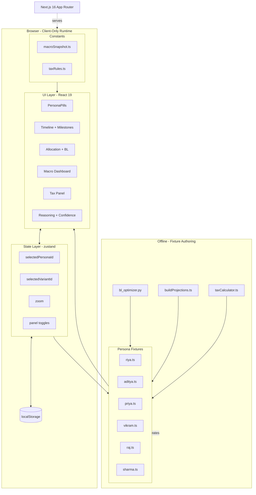
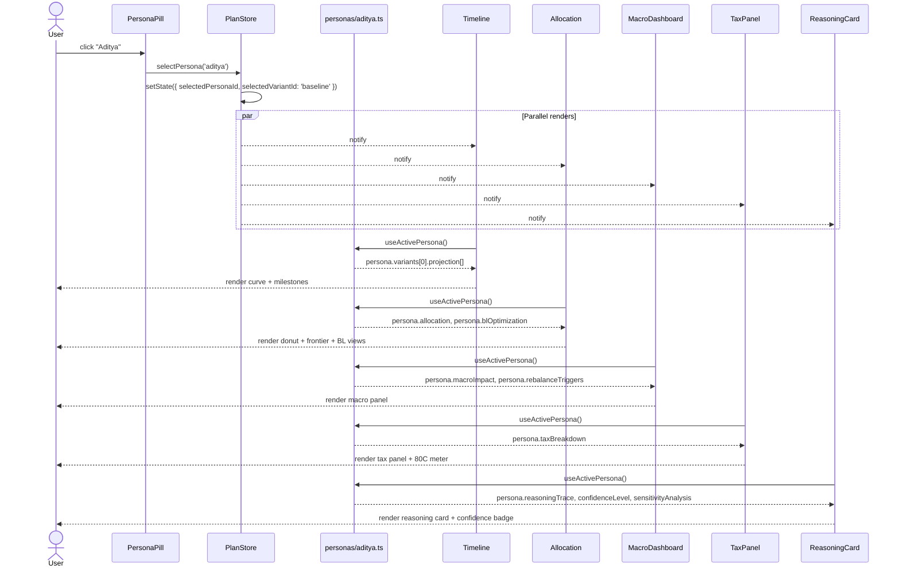

# Project Horizon (PS-09) - System Design and Architecture

> Sibling docs: [PRD](./PRD.md) - [Implementation Plan](./PLAN.md)

> **v1 is a frontend-only modular investment intelligence platform.** Six personas ship as TypeScript modules carrying fully pre-baked data: Black-Litterman optimized allocations, macro context, tax-adjusted returns, reasoning traces, and confidence levels. All complex computation (BL optimization, macro forecasting, tax calculation) runs **offline at fixture-authoring time**. The runtime job is rendering and switching - not computing.

## 1. High-Level Architecture



**Key architectural decisions**

1. **No runtime computation.** All BL optimization, projections, tax calculations, reasoning traces, and confidence levels are pre-computed and shipped as literal data.
2. **Five intelligence layers, all pre-baked.** User profiling, portfolio optimization (Black-Litterman), macro forecasting, tax engine, and dynamic adjustment are all computed offline and stored in fixtures.
3. **Decision-driven output.** Every allocation comes with a reasoning trace, confidence level, and sensitivity analysis - authored at fixture time, not generated at runtime.
4. **Variants instead of sliders.** What-if interactions select between 2-3 pre-baked variants per persona.
5. **Unidirectional data flow.** Pill click -> store -> selector picks fixture -> render.
6. **SVG for all charts.** Timeline curve, donut, glide path, efficient frontier - all hand-rolled SVG for accessibility and animation control.

## 2. Module / Folder Structure

```text
horizon26/
+-- app/
|   +-- layout.tsx
|   +-- page.tsx                      # orchestrator (client component)
|   +-- globals.css                   # @theme tokens
+-- components/
|   +-- PersonaPills/
|   |   +-- PersonaPill.tsx
|   |   +-- PersonaPillRow.tsx
|   |   +-- VariantPills.tsx
|   |   +-- PersonaSnapshotCard.tsx
|   +-- Timeline/
|   |   +-- TimelineCanvas.tsx
|   |   +-- ProjectionCurve.tsx
|   |   +-- MilestoneMarker.tsx
|   |   +-- MilestoneDetailPanel.tsx
|   |   +-- AxisX.tsx
|   |   +-- AxisY.tsx
|   |   +-- ZoomController.tsx
|   +-- Allocation/
|   |   +-- DonutChart.tsx
|   |   +-- GlidePathChart.tsx
|   |   +-- EfficientFrontierChart.tsx
|   |   +-- BLViewsPanel.tsx
|   |   +-- InstrumentList.tsx
|   +-- Macro/
|   |   +-- MacroDashboard.tsx
|   |   +-- MacroSparklines.tsx
|   |   +-- MacroImpactCard.tsx
|   |   +-- RebalanceTriggersCard.tsx
|   +-- Tax/
|   |   +-- TaxBreakdownPanel.tsx
|   |   +-- Section80CMeter.tsx
|   |   +-- TaxEfficientCallout.tsx
|   +-- Reasoning/
|   |   +-- ReasoningTraceCard.tsx
|   |   +-- ConfidenceBadge.tsx
|   |   +-- SensitivityTable.tsx
|   |   +-- WhyThisAllocationTooltip.tsx
|   +-- Narration/
|       +-- GapNarrator.tsx
+-- lib/
|   +-- viz/
|   |   +-- scales.ts
|   |   +-- path.ts
|   |   +-- zoomTransform.ts
|   +-- tax/
|   |   +-- indianTax.ts              # tax rules (for P1 live recompute)
|   +-- persistence/
|   |   +-- storage.ts
|   +-- constants/
|   |   +-- categories.ts
|   |   +-- colors.ts
|   |   +-- macroSnapshot.ts          # Apr 2026 hardcoded macro data
|   |   +-- taxRules.ts               # FY 2025-26 tax rules
|   +-- types.ts
+-- store/
|   +-- usePlanStore.ts               # zustand
+-- data/
|   +-- personas/
|   |   +-- riya.ts
|   |   +-- aditya.ts
|   |   +-- priya.ts
|   |   +-- vikram.ts
|   |   +-- raj.ts
|   |   +-- sharma.ts
|   |   +-- index.ts                  # barrel export + ordered list
+-- scripts/                          # offline only, NOT shipped
    +-- bl_optimizer.py               # Black-Litterman optimization
    +-- buildProjections.ts           # forward sim + milestone status
    +-- taxCalculator.ts              # tax breakdown per persona
```

## 3. Core Type Model

```ts
// lib/types.ts

// === Enums and basic types ===

export type Category = 'home' | 'business' | 'education' | 'wedding' | 'vehicle' | 'travel' | 'retirement' | 'health' | 'legacy' | 'custom';
export type RiskProfileName = 'CONSERVATIVE' | 'MODERATE_CONSERVATIVE' | 'MODERATE' | 'MODERATE_AGGRESSIVE' | 'AGGRESSIVE' | 'VERY_AGGRESSIVE';
export type ZoomLevel = '5year' | '10year' | 'full';
export type MilestoneStatus = 'ON_TRACK' | 'SHORTFALL' | 'SURPLUS';
export type AssetClass = 'equity' | 'debt' | 'gold' | 'liquid';

// === Allocation ===

export interface Allocation {
  equity: number;  // 0..1
  debt: number;
  gold: number;
  liquid: number;
}

// === Milestones ===

export interface Milestone {
  id: string;
  label: string;
  age: number;
  category: Category;
  nominalCost: number;      // today's Rs.
  inflatedCost: number;     // Rs. at milestone age (pre-computed)
  projectedBalance: number; // balance just before drawdown (pre-computed)
  status: MilestoneStatus;
  gap: number;              // positive = shortfall, negative = surplus
}

// === Projection ===

export interface ProjectionPoint {
  age: number;
  balance: number;
}

export interface GlidePathPoint {
  age: number;
  allocation: Allocation;
}

// === Black-Litterman ===

export interface InvestorView {
  asset: AssetClass;
  viewReturn: number;       // investor's expected return
  equilibriumReturn: number;// CAPM equilibrium return
  confidence: number;       // 0..1
  rationale: string;        // why this view
}

export interface EfficientFrontierPoint {
  risk: number;   // std dev
  return: number; // expected return
}

export interface BLOptimization {
  equilibriumWeights: Allocation;
  views: InvestorView[];
  posteriorReturns: Record<AssetClass, number>;
  efficientFrontier: EfficientFrontierPoint[];
  selectedPoint: EfficientFrontierPoint;
}

// === Macro ===

export interface MacroSnapshot {
  repoRate: number;         // e.g., 0.0525
  inflation: number;        // e.g., 0.046
  gdpGrowth: number;        // e.g., 0.069
  crudeOil: string;         // e.g., "> $100/bbl"
  marketOutlook: string;    // e.g., "Range-bound H1, potential rally H2"
  asOfDate: string;         // e.g., "2026-04-25"
}

export interface RebalanceTrigger {
  trigger: string;          // e.g., "Inflation > 5.5%"
  action: string;           // e.g., "Shift 5% from debt to gold"
  rationale: string;
}

// === Tax ===

export interface TaxBreakdown {
  preTaxReturn: number;
  postTaxReturn: number;
  taxDrag: number;          // preTax - postTax
  ltcgAmount: number;       // Rs.
  stcgAmount: number;
  debtTaxAmount: number;
  section80CUsed: number;
  section80CLimit: number;  // 150000
  section80CCDUsed: number;
}

// === Reasoning and Confidence ===

export interface SensitivityAnalysis {
  factor: string;           // e.g., "Inflation +1%"
  impact: string;           // e.g., "Real return drops from 6.9% to 5.8%"
}

// === Instruments ===

export interface Instrument {
  name: string;
  category: AssetClass;
  monthly: number;          // Rs.
  rationale: string;
}

// === Persona Variant ===

export interface PersonaVariant {
  id: string;
  label: string;            // e.g., "32 K SIP"
  monthlyContribution: number;
  projection: ProjectionPoint[];
  milestones: Milestone[];
}

// === Persona Snapshot ===

export interface PersonaSnapshot {
  currentAge: number;
  monthlyContribution: number;
  currentNetWorth: number;
  inflationAssumption: number;
}

// === Full Persona ===

export interface Persona {
  id: 'riya' | 'aditya' | 'priya' | 'vikram' | 'raj' | 'sharma';
  label: string;
  emoji: string;
  ageRange: string;
  riskProfile: RiskProfileName;
  headline: string;
  
  // Core
  snapshot: PersonaSnapshot;
  allocation: Allocation;
  glidePath: GlidePathPoint[];
  variants: PersonaVariant[];
  defaultVariantId: string;
  
  // Black-Litterman
  blOptimization: BLOptimization;
  
  // Buckets
  bucketAllocations: Record<string, Allocation>; // milestoneId -> allocation
  
  // Instruments
  instruments: Instrument[];
  
  // Macro
  macroImpact: string;
  rebalanceTriggers: RebalanceTrigger[];
  
  // Tax
  taxBreakdown: TaxBreakdown;
  
  // Reasoning
  reasoningTrace: string;
  confidenceLevel: number;  // 0..1, e.g., 0.85
  confidenceExplanation: string;
  sensitivityAnalysis: SensitivityAnalysis[];
  
  // Narration
  narration: Record<string, string>; // milestoneId -> one-liner
}
```

## 4. State Architecture (zustand)

```ts
// store/usePlanStore.ts

interface PlanStore {
  // Selection
  selectedPersonaId: Persona['id'];
  selectedVariantId: string;
  zoom: ZoomLevel;
  selectedMilestoneId?: string;
  
  // Panel toggles
  showMacroPanel: boolean;
  showTaxPanel: boolean;
  showReasoningPanel: boolean;
  
  // Actions
  selectPersona: (id: Persona['id']) => void;
  selectVariant: (id: string) => void;
  setZoom: (level: ZoomLevel) => void;
  selectMilestone: (id?: string) => void;
  toggleMacroPanel: () => void;
  toggleTaxPanel: () => void;
  toggleReasoningPanel: () => void;
}
```

**Selectors (memoized, not in state):**

- `useActivePersona()` -> `Persona`
- `useActiveVariant()` -> `PersonaVariant`
- `useActiveProjection()` -> `ProjectionPoint[]`
- `useActiveMilestones()` -> `Milestone[]`
- `useActiveBLOptimization()` -> `BLOptimization`
- `useActiveTaxBreakdown()` -> `TaxBreakdown`

## 5. Persona Switch - Data Flow



## 6. Black-Litterman Optimization (offline)

The BL model runs in `scripts/bl_optimizer.py` during fixture authoring. Here's the math:

**Step 1: Market equilibrium returns (CAPM)**

\[
\Pi = \delta \Sigma w_{mkt}
\]

where:
- \(\Pi\) = implied equilibrium returns
- \(\delta\) = risk aversion coefficient (typically 2.5)
- \(\Sigma\) = covariance matrix
- \(w_{mkt}\) = market-cap weights

**Step 2: Investor views**

Views are expressed as: "Asset X will return Y%". Each view has a confidence level that determines its weight.

\[
P \cdot \mu = Q + \epsilon
\]

where:
- \(P\) = pick matrix (which assets the view is about)
- \(Q\) = view returns
- \(\epsilon \sim N(0, \Omega)\), where \(\Omega\) scales with view confidence

**Step 3: Posterior returns**

\[
E[R] = [(\tau \Sigma)^{-1} + P' \Omega^{-1} P]^{-1} [(\tau \Sigma)^{-1} \Pi + P' \Omega^{-1} Q]
\]

where \(\tau\) is a scalar (typically 0.05) representing uncertainty in equilibrium.

**Step 4: Mean-variance optimization**

Given posterior returns \(E[R]\), solve for the efficient frontier:

\[
\min_w \frac{1}{2} w' \Sigma w - \lambda w' E[R]
\]

subject to \(\sum w_i = 1\), \(w_i \geq 0\).

**Step 5: Select allocation**

Pick the point on the efficient frontier that matches the persona's risk score.

**Output stored in fixture:**

```ts
blOptimization: {
  equilibriumWeights: { equity: 0.60, debt: 0.25, gold: 0.10, liquid: 0.05 },
  views: [
    { asset: 'equity', viewReturn: 0.14, equilibriumReturn: 0.11, confidence: 0.7, rationale: '...' }
  ],
  posteriorReturns: { equity: 0.128, debt: 0.072, gold: 0.085, liquid: 0.055 },
  efficientFrontier: [{ risk: 0.08, return: 0.07 }, { risk: 0.12, return: 0.095 }, ...],
  selectedPoint: { risk: 0.16, return: 0.118 }
}
```

## 7. Macro Forecasting (hardcoded)

Macro data is a **point-in-time snapshot** (Apr 2026), not live. Stored in `lib/constants/macroSnapshot.ts`:

```ts
export const macroSnapshot: MacroSnapshot = {
  repoRate: 0.0525,
  inflation: 0.046,
  gdpGrowth: 0.069,
  crudeOil: '> $100/bbl',
  marketOutlook: 'Range-bound H1, potential rally H2',
  asOfDate: '2026-04-25',
};
```

Each persona has:
- `macroImpact`: one-liner explaining how macro affects this persona
- `rebalanceTriggers[]`: what changes would cause what rebalancing (not executed at runtime)

## 8. Tax Engine

Tax rules are stored in `lib/constants/taxRules.ts` and can be used for P1 live recompute. For P0, tax breakdown is pre-computed per persona.

```ts
export const taxRules = {
  ltcg: {
    rate: 0.125,        // 12.5%
    exemption: 125000,  // Rs. 1.25 L
    holdingPeriod: 12,  // months
  },
  stcg: {
    rate: 0.20,         // 20%
  },
  debt: {
    // Post-2023: slab rate, no indexation
    slabRate: 0.30,     // assume 30% slab
  },
  gold: {
    ltcgRate: 0.20,     // with indexation if > 3 years
    holdingPeriod: 36,
  },
  section80C: {
    limit: 150000,
    instruments: ['ELSS', 'PPF', 'NPS', 'NSC', 'SCSS'],
  },
  section80CCD: {
    additionalLimit: 50000,  // NPS only
  },
};
```

Tax breakdown per persona:

```ts
taxBreakdown: {
  preTaxReturn: 0.128,
  postTaxReturn: 0.114,
  taxDrag: 0.014,
  ltcgAmount: 45000,
  stcgAmount: 0,
  debtTaxAmount: 12000,
  section80CUsed: 150000,
  section80CLimit: 150000,
  section80CCDUsed: 50000,
}
```

## 9. Reasoning and Confidence

Every persona has:

1. **Reasoning trace** - multi-paragraph explanation of allocation choice
2. **Confidence level** - 0..1 (e.g., 0.85 = 85%)
3. **Confidence explanation** - one-liner explaining the three factors
4. **Sensitivity analysis** - array of factor -> impact pairs

Confidence is computed (offline) based on:
- **BL model fit**: how well views align with historical data
- **Macro uncertainty**: crude oil volatility, geopolitical risk
- **Time horizon**: longer horizon = slightly lower confidence (more unknowns)

## 10. Age-Banded Allocation Reference

Base allocations by age band (before BL adjustment):

```text
Age 18-24  ->  VERY_AGGRESSIVE  equity 90 / debt 5  / gold 0 / liquid 5
Age 25-29  ->  AGGRESSIVE       equity 80 / debt 10 / gold 5 / liquid 5
Age 30-39  ->  GROWTH           equity 70 / debt 20 / gold 7 / liquid 3
Age 40-49  ->  BALANCED         equity 60 / debt 30 / gold 7 / liquid 3
Age 50-59  ->  PRE-RETIREE      equity 45 / debt 45 / gold 7 / liquid 3
Age 60+    ->  INCOME           equity 30 / debt 60 / gold 7 / liquid 3
```

Per-goal proximity de-risking (for `bucketAllocations`):

- <= 3 yrs -> 30 / 60 / 7 / 3
- 3-7 yrs -> 55 / 35 / 7 / 3
- \> 7 yrs -> use age-band

BL optimization tilts these base allocations based on investor views.

## 11. Canonical Math (used at fixture-build time)

**Forward simulation (monthly):**

```text
for month m in [currentAge*12 .. 90*12]:
    balance += monthlyContribution
    balance *= 1 + monthlyReturn(allocationAtAge(m/12))
    if milestoneOccursThisMonth:
        inflated = nominalCost * (1 + inflation) ^ yearsFromNow
        record { age, balance, inflatedCost, status, gap }
        balance -= inflated
    sample yearly -> ProjectionPoint[]
```

**Inflation adjustment:**

\[
C_t = C_0 \cdot (1 + i)^{t}
\]

**Blended monthly return:**

\[
r_{\text{monthly}} = \frac{1}{12} \sum_{k \in \{eq, debt, gold, liq\}} a_k \cdot r_k
\]

**Milestone status:**

\[
\text{gap} = \text{inflatedCost} - \text{projectedBalance}
\]

`gap > 0 -> SHORTFALL`, `gap < -threshold -> SURPLUS`, otherwise `ON_TRACK`.

## 12. Persistence Schema (`localStorage`)

```json
{
  "version": "v1",
  "selectedPersonaId": "aditya",
  "selectedVariantId": "baseline",
  "zoom": "10year",
  "showMacroPanel": true,
  "showTaxPanel": false,
  "showReasoningPanel": true
}
```

## 13. Performance Budget

| Step | Budget |
|---|---|
| Persona pill click -> store update | <= 1 ms |
| Selector re-run (6 components) | <= 3 ms |
| SVG re-render (all charts) | <= 10 ms |
| Cross-fade animation | 300 ms (CSS, GPU) |
| Total user-perceived switch | <= 400 ms |
| Initial JS bundle (gzipped) | <= 220 KB |

## 14. Demo Walkthrough (7-minute judge script)

1. **Land on `/`** -> Aditya pre-loaded -> see timeline, donut, confidence badge (85%).
2. **Scan reasoning trace** -> "You're 28 with high risk capacity... BL tilts toward mid-caps..."
3. **Check BL panel** -> see "Bullish domestic mid-caps: +3% vs equilibrium" view with confidence bar.
4. **Check efficient frontier mini-chart** -> see Aditya's allocation point marked.
5. **Scan macro dashboard** -> repo 5.25%, inflation 4.6%, market outlook. Macro impact: "Elevated inflation increases apartment cost..."
6. **Check tax panel** -> pre-tax 12.8%, post-tax 11.4%, 80C fully utilized.
7. **Tap apartment milestone** -> see shortfall Rs. 62.4 L, bucket allocation 50/40/7/3, narration: "Increase SIP to Rs. 48 K or take home loan..."
8. **Switch to "48 K SIP" variant** -> milestone flips green, confidence unchanged.
9. **Switch to Riya** -> see 90/5/0/5 allocation, 80% confidence, reasoning: "Compounding power of starting at 20..."
10. **Switch to Sharma** -> see SWP-focused view, income panel, 90% confidence, "Income-secure for 25 yrs".
11. **End**: emphasize decision-driven output - "Not just *what* to invest, but *why* and *how confident*."
